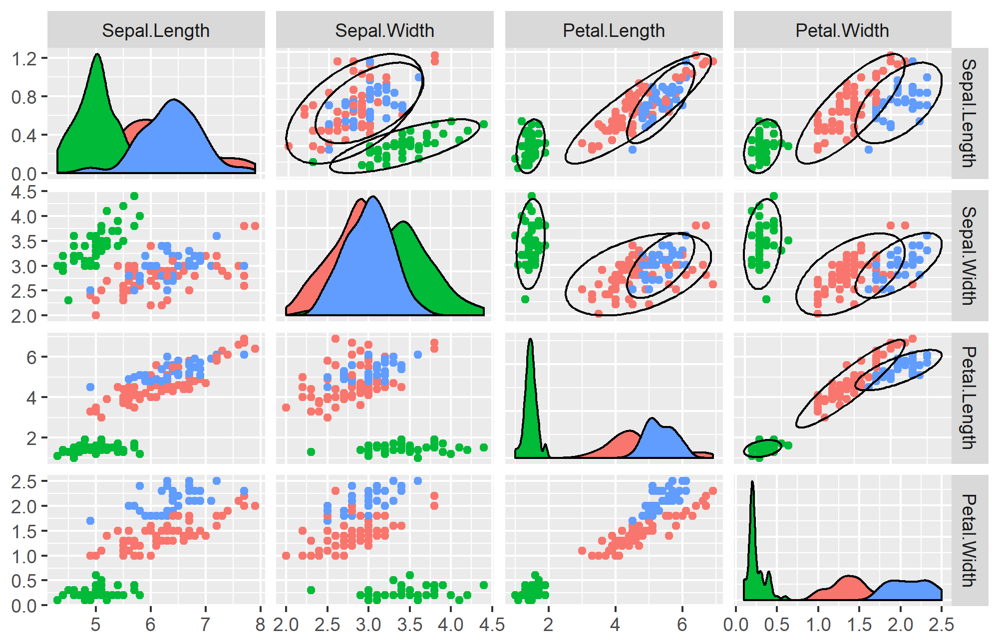

# Description of files 

**plot_contour** - given a normal mixture model and data, this function fits contours of the components. 

Fit a mixture model using EMMIX R package
```
library(EMMIX)
fit <- EMMIX(dat = iris[, -5], g = 3)
```

Display contours
```
plot_contour(fit, iris[, -5])
```



